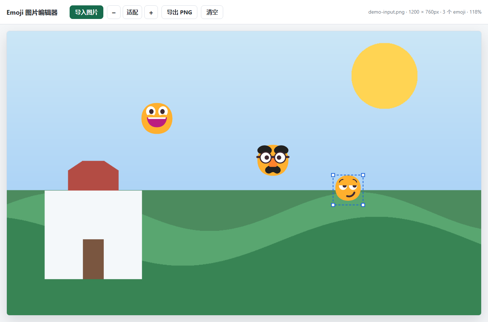

# Emoji 图片编辑器

一个简单的本地网页小工具，用来给图片快速添加透明底 emoji 笑脸，并导出编辑后的清晰 PNG 图片。



## 功能

- 导入本地图片进行编辑
- 在图片上右键添加随机 emoji 笑脸
- 每次新增 emoji 会尽量避免重复
- 左键拖动 emoji 可移动位置
- 拖拽 emoji 的选中边框可等比例放大或缩小
- 新增 emoji 会沿用最近一次调整后的尺寸
- 支持滚轮缩放图片视图、拖拽平移图片
- 导出 PNG 时按原始图片尺寸重新绘制，保持画质清晰

## 使用方法

直接打开 `index.html` 即可使用，不需要安装依赖，也不需要启动后端服务。

1. 点击“导入图片”选择本地图片。
2. 在图片上右键添加 emoji。
3. 左键拖动 emoji 调整位置。
4. 拖动 emoji 边框调整大小。
5. 使用鼠标滚轮缩放图片视图，拖拽空白图片区域平移视图。
6. 点击“导出 PNG”保存编辑后的图片。

如果浏览器对本地文件访问限制较严格，也可以在项目目录运行本地静态服务：

```powershell
python -m http.server 5173 --bind 127.0.0.1
```

然后访问：

```text
http://127.0.0.1:5173/
```

## 项目结构

```text
.
├── index.html
├── styles.css
├── app.js
├── assets/
│   └── demo.png
└── README.md
```

## 技术说明

项目使用原生 HTML、CSS 和 JavaScript 实现。编辑数据保存在原始图片坐标系中，页面缩放和平移只影响预览视图；导出时会在离屏 canvas 中按原图尺寸重新绘制图片和 emoji。
